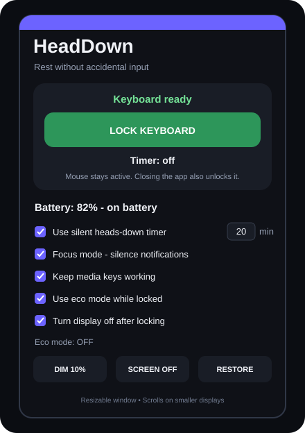
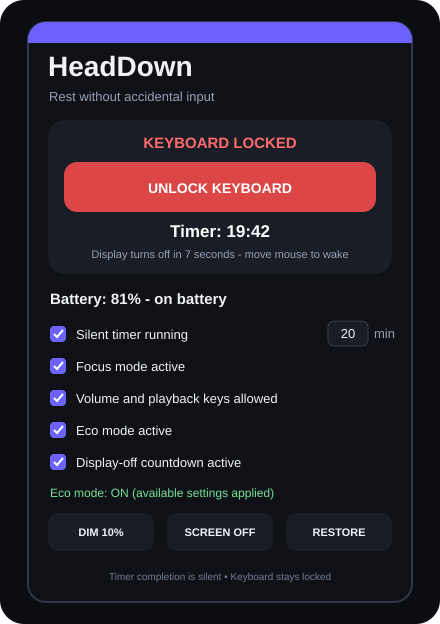

# HeadDown

HeadDown is a lightweight, mouse-controlled keyboard rest mode for Windows 10 and Windows 11. It temporarily blocks normal keyboard input so you can safely rest your head or place something on the keyboard without filling a document with random keys, opening shortcuts, or triggering commands.

The mouse stays active the entire time. Unlocking is always one click away.

## Interface preview

<p align="center">
  
  
</p>

## Features

- **Mouse-only lock and unlock** with one large button
- **Global keyboard blocking** while HeadDown is locked
- **Automatic recovery** when the app closes or stops running
- **Always-on-top status window** while the keyboard is locked
- **Silent heads-down timer** from 1 to 180 minutes
- **Focus mode** that silences normal Windows toast notifications while locked
- **Optional media-key passthrough** for volume, play/pause, next, previous, and stop
- **Battery percentage and charging status** display
- **Eco mode** that switches to Windows Power Saver and dims the built-in display
- **Automatic screen-off timer** 10 seconds after locking
- **Screen Off**, **Dim to 10%**, and **Restore** power-control buttons
- **Original settings restoration** after unlocking or closing the app
- **No installation, administrator access, account, or internet connection required**

## Quick start

1. Download `HeadDown-Windows.zip` from this repository and extract it.
2. Make sure a working mouse or trackpad is available.
3. Double-click `Start HeadDown.bat`.
4. Choose a timer length or turn the silent timer off.
5. Click **LOCK KEYBOARD**.
6. Click **UNLOCK KEYBOARD** with the mouse when you are finished.

If Windows blocks the downloaded script, right-click `HeadDown.ps1`, select **Properties**, check **Unblock**, select **Apply**, and launch it again.

## Silent timer

The timer starts when the keyboard is locked and never plays an alarm. When it reaches zero, HeadDown wakes the display, restores Eco and Focus settings, and brings the window forward. The keyboard stays locked until **UNLOCK KEYBOARD** is clicked, preventing accidental input if you are still resting on it.

The timer accepts any whole number from 1 to 180 minutes.

## Focus and media keys

Focus mode temporarily disables normal Windows toast notifications while the keyboard is locked and restores the previous notification setting when the timer finishes, the keyboard is unlocked, or the app closes. A recovery marker lets HeadDown repair the setting the next time it opens if the previous session ended unexpectedly.

When media-key passthrough is enabled, volume mute/down/up and playback previous/next/stop/play-pause continue working. All ordinary typing and shortcut keys remain blocked.

## Battery controls

| Control | What it does |
| --- | --- |
| Use eco mode while locked | Activates the Windows Power Saver plan and sets supported built-in displays to 10% brightness. |
| Turn display off after locking | Turns the display off 10 seconds after the keyboard is locked. Moving the mouse wakes it. |
| Dim to 10% | Immediately dims a supported built-in laptop display. |
| Screen Off | Immediately turns the display off without putting the computer to sleep. |
| Restore | Restores the power plan and brightness that were active when HeadDown started. |

External monitors may not support Windows' built-in brightness interface. The keyboard lock, power-plan control, and Screen Off button still work when brightness control is unavailable.

## How it works

HeadDown uses a Windows low-level keyboard hook (`WH_KEYBOARD_LL`) to intercept normal keyboard messages while lock mode is active. It does **not** disable or uninstall the keyboard device or modify its driver.

The hook exists only while HeadDown is running. The program explicitly releases it when you unlock or exit, and Windows removes it automatically if the process ends unexpectedly. Power controls use Windows' built-in `powercfg`, monitor-power message, and WMI brightness interfaces.

## Safety and limitations

- Have a working mouse or trackpad available before locking.
- `Ctrl+Alt+Delete` is handled directly by Windows and cannot be intercepted by a normal desktop program. If it opens, click **Cancel** with the mouse.
- Dedicated hardware buttons and some vendor-specific keys may not behave like standard keyboard input.
- HeadDown is a comfort tool, not a security lock. Use `Win+L` when you need to protect your account or files.
- The current package targets Windows PowerShell 5.1, included with Windows 10 and Windows 11.

## Project files

```text
HeadDown.ps1          Main Windows Forms application and keyboard hook
Start HeadDown.bat    Double-click launcher
README.txt            Offline instructions included with the download
README.md             GitHub project documentation
LICENSE               MIT license
HeadDown-Windows.zip   Ready-to-run Windows download
docs/*.svg             Ready and locked interface previews
```

## Run from PowerShell

```powershell
powershell.exe -NoProfile -ExecutionPolicy Bypass -File .\HeadDown.ps1
```

## Privacy

HeadDown does not record, save, or transmit keystrokes. When locked, keyboard messages are discarded immediately. The app contains no networking, analytics, automatic updates, or background service.

## License

Released under the [MIT License](LICENSE).
