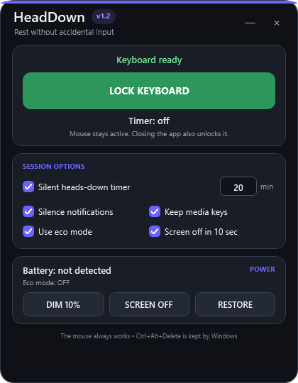

# HeadDown

HeadDown is a compact Windows desktop app that temporarily blocks normal keyboard input while keeping the mouse available. It is designed for resting your head—or anything else—on the keyboard without sending random keystrokes or shortcuts.

**Current build: v1.2 WPF**

## The real interface

  

The image above is rendered directly from the compiled WPF app during its Windows build. It is not a separate design mockup.

## Features

- Polished WPF interface matching the project preview
- Rounded status, session-options, and battery cards
- Compact default window that remains fully resizable
- One-click mouse-controlled keyboard lock and unlock
- Silent heads-down timer from 1 to 180 minutes
- Optional Windows notification silencing while locked
- Optional volume and playback media-key passthrough
- Battery percentage and charging-state display
- Eco mode using Windows Power Saver and supported display brightness
- Screen-off countdown and instant screen-off control
- Automatic restoration of power, brightness, and notification settings
- No installer, administrator access, account, analytics, or network connection

## Download and run

1. [Download HeadDown-Windows.zip](HeadDown-Windows.zip).
2. Extract the ZIP into a new folder.
3. Double-click **HeadDown.exe**.
4. Choose your session options.
5. Click **LOCK KEYBOARD**.
6. Click **UNLOCK KEYBOARD** with the mouse when finished.

The EXE targets the built-in .NET Framework 4.8 Windows desktop runtime. No separate setup program is required on current Windows 10 and Windows 11 systems.

If Microsoft Defender SmartScreen appears, confirm that the file came from this repository, select **More info**, and choose **Run anyway**. HeadDown is not code-signed.

## How the lock behaves

HeadDown installs a standard Windows low-level keyboard hook only while lock mode is active. Normal typing and shortcuts are discarded immediately; keystrokes are never saved or transmitted. The mouse remains active.

When media keys are enabled, volume mute/down/up and playback previous/next/stop/play-pause continue working. **Ctrl+Alt+Delete** is handled directly by Windows and cannot be intercepted by a normal desktop application.

Closing the app always releases its keyboard hook. Windows also removes the hook automatically if the process ends unexpectedly.

## Silent timer

The timer never plays an alarm. When it finishes, HeadDown wakes the display, restores Eco and notification settings, and brings the window forward. The keyboard remains locked until **UNLOCK KEYBOARD** is clicked.

## Battery controls

| Control | Behavior |
| --- | --- |
| Use eco mode | Activates Windows Power Saver and sets supported built-in displays to 10% brightness while locked. |
| Screen off in 10 sec | Turns the display off after locking; mouse movement wakes it. |
| DIM 10% | Immediately dims a supported built-in laptop display. |
| SCREEN OFF | Immediately turns the display off without putting Windows to sleep. |
| RESTORE | Restores the power plan and brightness captured when HeadDown opened. |

External monitors may not expose brightness control through Windows. Keyboard locking, Power Saver, and screen-off control still work when brightness adjustment is unavailable.

## Verified Windows build

Every source change runs the repository's Windows workflow. It:

1. Compiles the WPF project.
2. Constructs the actual application window.
3. Renders the interface image shown above.
4. Packages the tested EXE.
5. Publishes **dist/HeadDown.exe** and **HeadDown-Windows.zip**.

You can inspect the results on the repository's [Actions page](../../actions).

## Build it yourself

Requirements:

- Windows 10 or Windows 11
- Visual Studio 2022 Build Tools with the .NET desktop build tools
- .NET Framework 4.8 targeting pack

    msbuild src\HeadDown\HeadDown.csproj /restore /t:Build /p:Configuration=Release

The compiled application is written to:

    src\HeadDown\bin\Release\net48\HeadDown.exe

## Project layout

    src/HeadDown/                 WPF application source
    dist/HeadDown.exe             Latest workflow-built executable
    HeadDown-Windows.zip          Latest tested download package
    docs/actual-ui.png            Interface rendered from the real app
    HeadDown.ps1                  Legacy PowerShell fallback
    Start HeadDown.bat            Legacy PowerShell launcher
    README.txt                    Offline package instructions
    LICENSE                       MIT license
    .github/workflows/            Windows build and interface test

## Security and privacy

HeadDown does not record, log, save, or transmit keystrokes. It has no networking code, updater, analytics, advertising, background service, or driver. It is a comfort tool—not a security lock. Use **Win+L** when you need to protect your Windows account.

## License

Released under the [MIT License](LICENSE).
